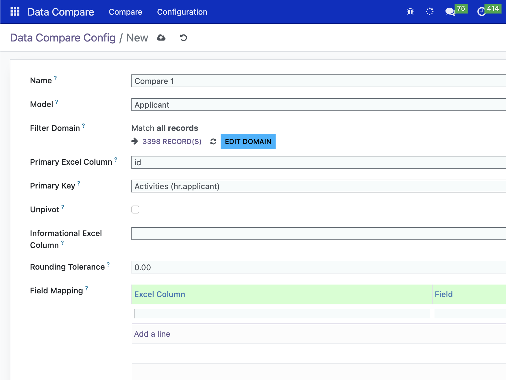

# Universal Data Compare

**Universal Data Compare** is an Odoo module that allows users to compare data between **Excel files and Odoo records** based on configurable models, fields, primary keys, and field mappings.

The module is designed to provide a reusable data validation and reconciliation tool without requiring custom comparison logic for every Odoo model.



---

## Features

### 1. Configurable Odoo Model

Users can create comparison configurations for different Odoo models.

Each configuration defines:

* Target Odoo model
* Filter domain
* Primary Excel column
* Odoo primary key field
* Informational Excel column
* Excel-to-Odoo field mappings
* Unpivot configuration
* Rounding tolerance
* Active/inactive status

This makes the comparison engine reusable across different Odoo modules and business processes.

---

### 2. Excel File Comparison

The module supports:

* `.xlsx`
* `.xls`
* Excel files exported as HTML tables

The uploaded Excel file is automatically processed and compared against the selected Odoo model.

---

### 3. Primary Key Matching

Records can be matched using a configurable primary key.

For example:

```text
Excel Primary Column: Employee Code
Odoo Primary Field: employee_code
```

The comparison engine uses the configured primary key to identify the corresponding Odoo record.

Duplicate primary keys in Odoo are detected automatically to prevent incorrect comparison results.

---

### 4. Field Mapping

Users can define which Excel columns should be compared against which Odoo fields.

Example:

| Excel Column  | Odoo Field    |
| ------------- | ------------- |
| Employee Code | employee_code |
| Employee Name | name          |
| Department    | department_id |
| Salary        | wage          |
| Status        | state         |

Only configured columns are compared.

Columns that exist in the Excel file but are not included in the configuration are reported as **unchecked columns**.

---

### 5. Multiple Odoo Field Types

The comparison engine supports different Odoo field types, including:

* Char
* Text
* Selection
* Integer
* Float
* Monetary
* Date
* Boolean
* Many2one

The comparison logic automatically adapts according to the Odoo field type.

---

### 6. Many2one Comparison

For Many2one fields, the comparison uses the Odoo record's `display_name`.

For example:

```text
Excel:
Finance Department

Odoo:
department_id.display_name = Finance Department
```

This allows users to compare human-readable values instead of database IDs.

---

### 7. Selection Field Comparison

Selection fields can be compared against either their:

* Database key
* Display label

For example, if an Odoo selection field contains:

```python
[
    ('draft', 'Draft'),
    ('approved', 'Approved'),
    ('rejected', 'Rejected'),
]
```

Both of the following Excel values can be recognized:

```text
approved
```

or:

```text
Approved
```

---

### 8. Numeric Comparison and Rounding Tolerance

Float and monetary fields support configurable rounding tolerance.

For example:

```text
Excel: 100.00
Odoo: 100.004
Tolerance: 0.01
```

The values will be considered a **Match** because the difference is within the configured tolerance.

For monetary fields, the module can also use the rounding configuration of the Odoo currency.

---

### 9. Unpivot Support

The module supports comparison scenarios where a record needs to be identified using a combination of:

```text
Primary Key + Unpivot Value
```

For example:

```text
Employee Code + Month
```

or:

```text
Product Code + Warehouse
```

A configuration can specify:

* Unpivot field
* Unpivot value for each mapping

This allows the same primary key to represent multiple comparable records.

---

### 10. Comparison Result

Comparison results are stored as individual comparison lines.

Each result contains:

* Primary Excel Value
* Informational Excel Value
* Unpivot Value
* Field Compared
* Excel Value
* Odoo Value
* Status

The available statuses are:

| Status        | Description                                      |
| ------------- | ------------------------------------------------ |
| **Match**     | Excel and Odoo values are considered equal       |
| **Mismatch**  | Excel and Odoo values are different              |
| **Not Found** | The corresponding Odoo record could not be found |

Only mismatched values are stored as comparison result lines during the normal comparison process, while missing records are recorded as `Not Found`.

---

## Configuration

Create a **Data Compare Configuration** and define the target model.

### Basic Configuration

Example:

```text
Name:
Employee Data Comparison

Model:
hr.employee

Filter Domain:
[('active', '=', True)]

Primary Excel Column:
Employee Code

Primary Key:
employee_code

Informational Excel Column:
Employee Name

Rounding Tolerance:
0.01
```

---

## Field Mapping

After selecting the target model, configure the Excel-to-Odoo field mappings.

Example:

| Excel Column  | Odoo Field    | Unpivot Value |
| ------------- | ------------- | ------------- |
| Employee Name | name          |               |
| Department    | department_id |               |
| Salary        | wage          |               |
| Status        | state         |               |

The available Odoo fields are restricted to fields belonging to the selected model.

---

## Filter Domain

A filter domain can be used to limit the Odoo records included in the comparison.

Example:

```python
[('active', '=', True)]
```

Another example:

```python
[
    ('company_id', '=', 1),
    ('active', '=', True)
]
```

This is useful when the Odoo database contains multiple records with the same business key but only a specific subset should be compared.

---

## Comparison Workflow

The general workflow is:

```text
Create Configuration
        |
        v
Select Odoo Model
        |
        v
Configure Filter Domain
        |
        v
Configure Primary Key
        |
        v
Configure Excel/Odoo Field Mapping
        |
        v
Upload Excel File
        |
        v
Run Compare
        |
        v
Match Excel Rows with Odoo Records
        |
        v
Compare Configured Fields
        |
        v
Generate Comparison Results
```

---

## Duplicate Detection

The module validates duplicate primary keys before starting the comparison.

For example, if the configured primary key is:

```text
employee_code
```

and Odoo contains:

```text
EMP001
EMP002
EMP001
```

the comparison is stopped and the duplicate key is reported.

This prevents one Excel record from being incorrectly matched against multiple Odoo records.

For configurations using **Unpivot**, the matching key becomes:

```text
Primary Key + Unpivot Value
```

---

## Unchecked Excel Columns

The module automatically detects Excel columns that are not included in the configured field mappings.

For example, if the Excel file contains:

```text
Employee Code
Employee Name
Department
Salary
Phone
Address
```

but only these columns are configured:

```text
Employee Code
Employee Name
Department
Salary
```

the module reports:

```text
Phone
Address
```

as unchecked columns.

This helps users identify Excel data that is not being validated.

---

## Export Comparison Results

Comparison results can be exported back to Excel.

The generated file contains:

| Column                    |
| ------------------------- |
| Primary Excel Value       |
| Informational Excel Value |
| Unpivot Value             |
| Field Compared            |
| Excel Value               |
| Odoo Value                |
| Status                    |

Mismatch results are highlighted to make them easier to review.

---

## Example Use Cases

### Employee Data Validation

Compare employee data maintained in Excel against:

```text
hr.employee
```

Possible fields:

* Employee Code
* Employee Name
* Department
* Job Position
* Work Email
* Salary
* Status

---

### Product Data Validation

Compare product master data from Excel against:

```text
product.template
```

Possible fields:

* Internal Reference
* Product Name
* Sales Price
* Cost
* Product Category
* Product Type

---

### Accounting Data Reconciliation

Compare financial values between Excel and Odoo.

For example:

```text
Account Code
Account Name
Debit
Credit
Balance
```

Numeric fields can use rounding tolerance to avoid false mismatches caused by decimal rounding.

---

### Inventory Data Validation

Compare inventory-related data from Excel against Odoo records.

For example:

```text
Product Code
Warehouse
Quantity
Reserved Quantity
```

Unpivot functionality can be useful when the same product needs to be compared across multiple warehouses or locations.

---

## Technical Structure

A simplified module structure:

```text
universal_data_compare/
├── README.md
├── LICENSE
├── __init__.py
├── __manifest__.py
├── models/
│   ├── __init__.py
│   ├── data_compare.py
│   ├── data_compare_config.py
│   └── data_compare_line.py
├── views/
│   ├── data_compare_views.xml
│   └── data_compare_config_views.xml
├── security/
│   └── ir.model.access.csv
└── static/
    └── description/
        └── screenshot1.png
```

---

## Requirements

* Odoo 19.0
* Python 3
* `pandas`
* `openpyxl`
* `xlrd`
* `xlsxwriter`

The required Python libraries must be available in the Odoo server environment.

For example:

```bash
pip install pandas openpyxl xlrd xlsxwriter
```

---

## Installation

1. Copy the module into your Odoo addons directory.

2. Make sure the required Python dependencies are installed.

3. Restart the Odoo server.

4. Update the Apps list.

5. Search for:

```text
Universal Data Compare
```

6. Install the module.

---

## Security

The module should be configured with appropriate Odoo access rights for:

* Data Compare Configuration
* Data Compare Configuration Field Mapping
* Data Compare
* Data Compare Line

Users should only be given access to Odoo models and data that they are authorized to compare.

---

## Manifest Example

```python
{
    'name': 'Universal Data Compare',
    'version': '19.0.1.0.0',
    'category': 'Tools',
    'summary': 'Compare Excel data with Odoo records',
    'description': """
Universal Data Compare
======================

A configurable tool for comparing Excel data
against Odoo records using configurable models,
primary keys, domains, and field mappings.
""",
    'author': 'Alex Dhika',
    'license': 'LGPL-3',
    'depends': [
        'base',
        'mail',
    ],
    'data': [
        # Add XML and CSV files here
    ],
    'installable': True,
    'application': True,
}
```

---

## License

This module is licensed under the [GNU Lesser General Public License v3.0](LICENSE).

Copyright © 2026 [Surya Semesta Berkat Dunia](https://www.suryasemesta.com).
